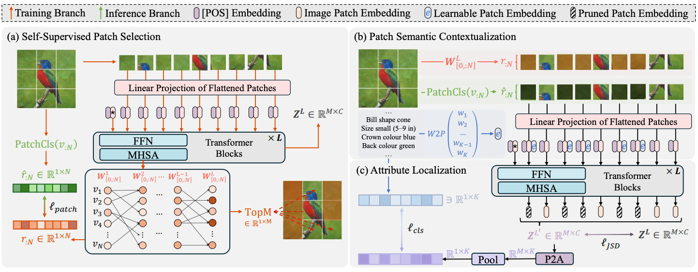

[//]: # (# SVIP)

[//]: # ([ICCV2025] Official Pytorch implementation for SVIP (SVIP: Semantically Contextualized Visual Patches for Zero-Shot Learning))

<div align="center">
    
    <h2><strong>SVIP: Semantically Contextualized Visual Patches for Zero-Shot Learning</strong></h2>
</div>

<div align="center">
    <a href="https://uqzhichen.github.io/" target='_blank'>Zhi Chen</a><sup>1*</sup>&nbsp;&nbsp;&nbsp;
    <a href="https://github.com/JasonCodeMaker" target='_blank'>Zecheng Zhao</a><sup>2*</sup>&nbsp;&nbsp;&nbsp;
    <a href="https://jingcaiguo.github.io/" target='_blank'>Jingcai Guo</a><sup>3</sup>&nbsp;&nbsp;&nbsp;
    <a href="https://lijin118.github.io/" target='_blank'>Jingjing Li</a><sup>4</sup>&nbsp;&nbsp;&nbsp;
    <a href="https://staff.itee.uq.edu.au/huang/" target='_blank'>Zi Huang</a><sup>2</sup>
    </br></br>
    <sup>1</sup>University of Southern Queensland &nbsp;&nbsp;&nbsp;
    <sup>2</sup>University of Queensland &nbsp;&nbsp;&nbsp;
    </br></br>
    <sup>3</sup>The Hong Kong Polytechnic University&nbsp;&nbsp;&nbsp;
    </br></br>
    <sup>4</sup>University of Electronic Science and Technology of China&nbsp;&nbsp;&nbsp;
</div>

<br/>

<div align="center">
    <a href="https://arxiv.org/abs/2503.10252" target='_blank'>
        
    </a>&nbsp;
</div>

# About


SVIP is a transformer-based framework designed to enhance visual-semantic alignment for zero-shot learning. Specifically, we propose a self-supervised patch selection mechanism that preemptively learns to identify semantic-unrelated patches in the input space. This is trained with the supervision from aggregated attention scores across all transformer layers, which estimate each patch’s semantic score. As removing semantic-unrelated patches from the input sequence may disrupt object structure, we replace them with learnable patch embeddings. With initialization from word embeddings, we can ensure they remain semantically meaningful throughout feature extraction. Extensive experiments on ZSL benchmarks demonstrate that SVIP achieves stateof-the-art performance results while providing more interpretable and semantically rich feature representations.




# :gear: Installation

Python 3.12

PyTorch 2.5.1

All experiments are tested with a single NVIDIA RTX 3090 GPU.

# :hotsprings: Data Preparation

- Dataset: please download the dataset, i.e., [CUB](http://www.vision.caltech.edu/datasets/cub_200_2011/), [AWA2](https://cvml.ist.ac.at/AwA2/), [SUN](https://groups.csail.mit.edu/vision/SUN/hierarchy.html), and put the datasets in *./data/* folder
- Data split and meta data: please download the [info-files](https://drive.google.com/file/d/1j7bHCOOR6Rug106UkPFhQLirDjYBo--z/view?usp=sharing) folder and place it in *./info-files/*.
- attribute w2v: use scripts in *./tools* to generate attribute w2v and place in *./attribute/w2v* folder.
- Pre-trained models: please download the [pre-trained models](https://drive.google.com/file/d/1o1HRM8ZNnIp9CLPH0Y0E6W1N4xsr786c/view?usp=sharing) and place it in *./pretrained_models/*.

# :bar_chart: Main Results

We provide the trained ZSL model checkpoints for three datasets as follows:

 Dataset         | ZSL Accuracy |  Download link | GZSL Accuracy |  Download link | 
 |  ----  |--------------| ----  |---------------| ----  |
| CUB          | 79.8         |[Download](https://drive.google.com/file/d/1c6LxGBy1S_FknHJQ1T_d-kvr4Y90SF0R/view?usp=sharing) | 75.0          | [Download](https://drive.google.com/file/d/1c6LxGBy1S_FknHJQ1T_d-kvr4Y90SF0R/view?usp=sharing)
| AWA2         | 69.8         |[Download](https://drive.google.com/file/d/1E1mfEDancvDmZulsAOgMpf97isWJ113_/view?usp=sharing) | 74.9          | [Download](https://drive.google.com/file/d/1E1mfEDancvDmZulsAOgMpf97isWJ113_/view?usp=sharing)
| SUN          | 71.6         |[Download](https://drive.google.com/file/d/12_h1a4n5uzAjBTv3KUnxOKDLu7yGbqBz/view?usp=sharing) | 50.7          | [Download](https://drive.google.com/file/d/12_h1a4n5uzAjBTv3KUnxOKDLu7yGbqBz/view?usp=sharing)


# License

This work is under the [Apache License Version 2.0](https://www.apache.org/licenses/LICENSE-2.0), while some specific implementations in this codebase might be with other licenses.

Kindly refer to [LICENSE.md](./docs/LICENSE.md) for a more careful check, if you are using our code for commercial matters.

# Citation

If you find this work helpful for your research, please kindly consider citing our paper:

```bibtex
@inproceedings{chen2025svip,
    title = {SVIP: Semantically Contextualized Visual Patches for Zero-Shot Learning},
    author = {Chen, Zhi and Zhao, Zecheng and Guo, Jingcai and Li, Jingjing and Huang, Zi},
    booktitle = {IEEE/CVF International Conference on Computer Vision (ICCV)},
    year = {2025}
}
```